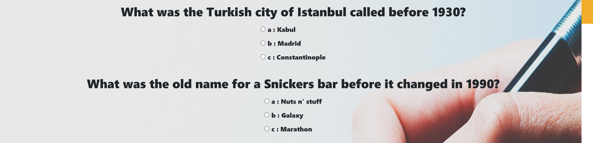
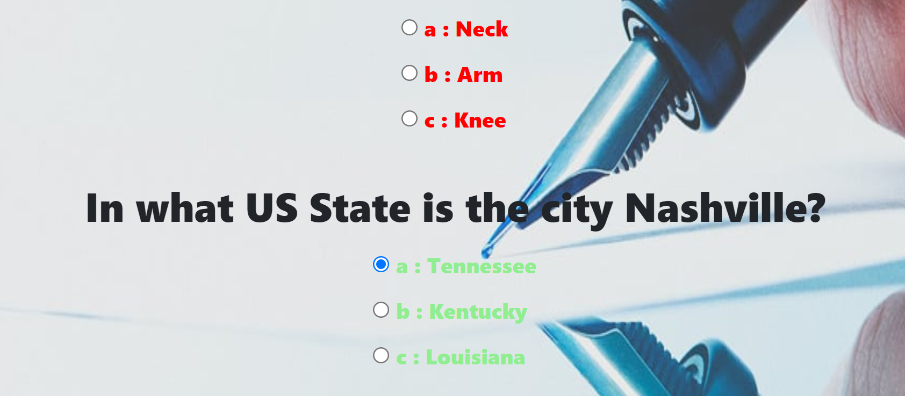

## Lets Get Quizzical!
### Let's get Quizzical is an interactive quiz site, where users can go through several questions, with multiple choice questions and the aim to complete all correctly. The site will test the users knowledge in general quiz questions and will prompt them to complete and submit answers to receive their final score. It's a great way to test even the most experienced quizz-goer!

Features

## Existing Features
## Header bar

### Featured on the main page, the fully responsive header bar inidicates the sites name and theme with icons to note the context.

## Questions

### The questions are prompted below in a linear fashion, with multple choice answers listed below for ease of use. There is an image laid over the back of the screen outlining the theme of the site.

## Previous/Next Questions
### This section will allow users to browse between questions, allowing them easily navigate the quiz.

## Submit

### This section will allow users to submit their answers once completed and when selected, will highlight correct answers as green and non correct as red.

## Results
### This section will confirm the users score once completed.

## Features Left to Implement
### Further questions
### Join page for frequent quizzers
### Subscription service with monthly live members room quizzes and prizes

### Testing

### In testing the site, I started by ensuring all pages were linked together and working at project level, checking to ensure images, icons, fonts, script and styling were being applied as intended. I then checked all questions to ensure answers were popluating correctly. I subsequently tested the next question/previous question and submit button to ensure the function was working. Lastly I checked that all media queries were working as required, before passing the code through official validators for errors.

## Validator Testing
### HTML
### No errors were returned when passing through the official W3C validator

## CSS
### No errors were found when passing through the official (Jigsaw) validator

## Javascript
### No errors were found when passing through the official JSHint validator.

## Unfixed Bugs
#### I would have liked the questions to appear in a single form as the script was loaded in a loop, rather than have all questions appear on the page in one single flow. Time was limited with this attempt and I decided to leave it working rather than submit without function.

## Deployment
#### The site was deployed to GitHub pages. The steps to deploy are as follows:
#### In the GitHub repository, navigate to the Settings tab
#### From the source section drop-down menu, select the Master Branch
#### Once the master branch has been selected, the page will be automatically refreshed with a detailed ribbon display to indicate the successful deployment.
#### The live link can be found here - 

## Credits
### The favicon image was downloaded from a open source site. 
### Google fonts was used for the main font styles.
### Fontawesome was used for the header icon
### Bootstrap for styling and media queries

## Media
### The background image is from https://michaelhyatt.com/science-of-pen-and-paper/